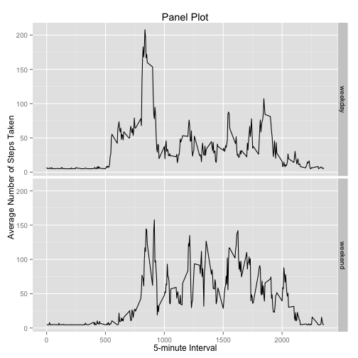

# Reproducible Research: Peer Assessment 1
## Basic Global Settings

```r
echo = TRUE          # Always make code visible
options(scipen = 1)  # Turn off scientific notations for numbers
```

## Plotting System

```r
library(ggplot2)
```

## Loading and preprocessing the data
### 1. Load the data (i.e. read.csv())

```r
if(!file.exists("activity.csv")){
    unzip("activity.zip")
}
activity <- read.csv("activity.csv")
```
### 2. Process/transform the data (if necessary) into a format suitable for your analysis

```r
# No processing needed
```

## What is mean total number of steps taken per day?
### 1. Calculate the total number of steps taken per day
#### ignore the missing values in the dataset

```r
stepsDay <- aggregate(activity$steps, list(nbr=as.numeric(activity$date), date=activity$date), FUN=sum, na.rm=TRUE)
```

### 2. Make a histogram of the total number of steps taken each day

```r
ggplot (stepsDay, aes(nbr, x)) + 
  geom_bar(stat="identity", width=0.5) +
  labs(title = "Histogram of Total Number of Steps Taken Each Day", x = "Day", y = "Total Number of Steps Taken Each Day")
```

 

### 3. Calculate and report the mean and median of the total number of steps taken per day

```r
stepsMean <- mean(stepsDay$x)
stepsMedian <- median(stepsDay$x)
```
* Mean: 9354.2295082
* Median:  10395

## What is the average daily activity pattern?
### 1. Make a time series plot (i.e. type = "l") of the 5-minute interval (x-axis) and the average number of steps taken, averaged across all days (y-axis)

```r
avg <- aggregate(x=list(steps=activity$steps), by=list(interval=activity$interval),  FUN=mean, na.rm=TRUE)
ggplot(avg, aes(interval, steps)) + 
  geom_line(size = 0.5) + 
  labs(title = "Time Series Plot of the 5-minute Interval", x = "5-minute Interval", y = "Average Number of Steps Taken")
```

 

### 2. Which 5-minute interval, on average across all the days in the dataset, contains the maximum number of steps?

```r
maxSteps = avg[avg$steps == max(avg$steps), ]
```

* 5-Minute Interval: 835 Has Maxium Steps of: 206.1698113

## Imputing missing values
### 1. Calculate and report the total number of missing values in the dataset (i.e. the total number of rows with NAs)

```r
missing = sum(is.na(activity))
```

* Total number of missing values: 2304

### 2. Devise a strategy for filling in all of the missing values in the dataset. The strategy does not need to be sophisticated. For example, you could use the mean/median for that day, or the mean for that 5-minute interval, etc.

### My strategy is to use the column mean to fill in the data 
### 3. Create a new dataset that is equal to the original dataset but with the missing data filled in.

```r
newData <- activity
for(i in 1:ncol(newData)){
  newData[is.na(newData[,i]), i] <- mean(newData[,i], na.rm = TRUE)
}
stepsDayImpute <- aggregate(newData$steps, list(nbr=as.numeric(newData$date), date=newData$date), FUN=sum)
```

### 4. Make a histogram of the total number of steps taken each day  


```r
ggplot(stepsDayImpute, aes(nbr, x)) + 
  geom_bar(stat = "identity", width = 0.5) + 
  labs(title = "Histogram of Total Number of Steps Taken Each Day (Imputed)", x = "Day", y = "Total Number of Steps")
```

 

### 4a. Calculate and report the mean and median total number of steps taken per day.

```r
stepsMeanImpute <- mean(stepsDayImpute$x)
stepsMedianImpute <- median(stepsDayImpute$x)
```
* Mean of Imputed Data: 10766.1886792
* Median of Imputed data:  10766.1886792

### 4b. Do these values differ from the estimates from the first part of the assignment? What is the impact of imputing missing data on the estimates of the total daily number of steps?

* Mean: 9354.2295082
* Median:  10395
* Difference of new Mean (Imputed) from old Mean: 1411.959171
* Difference of new Median (Imputed) from old Median: 371.1886792

### The values differ hence there is an impact to the imputed dataset - there are more steps taken than the non-imputed (i.e., original dataset).

## Are there differences in activity patterns between weekdays and weekends? Use data with filled in values

### 1. Create a new factor variable in the dataset with two levels – “weekday” and “weekend” indicating whether a given date is a weekday or weekend day.

```r
newData$factor <- ifelse(weekdays(as.Date(newData$date)) %in% c("Saturday", "Sunday"), "weekend", "weekday")
```


### 2. Make a panel plot containing a time series plot (i.e. type = "l") of the 5-minute interval (x-axis) and the average number of steps taken, averaged across all weekday days or weekend days (y-axis). 

```r
avgSteps <- aggregate(data=newData, steps ~ interval + factor, FUN=mean)
ggplot(avgSteps, aes(interval, steps)) + 
    geom_line(width=0.5) + 
    facet_grid(factor ~ .) +
    labs(title = "Panel Plot", x = "5-minute Interval", y = "Average Number of Steps Taken")
```

 


